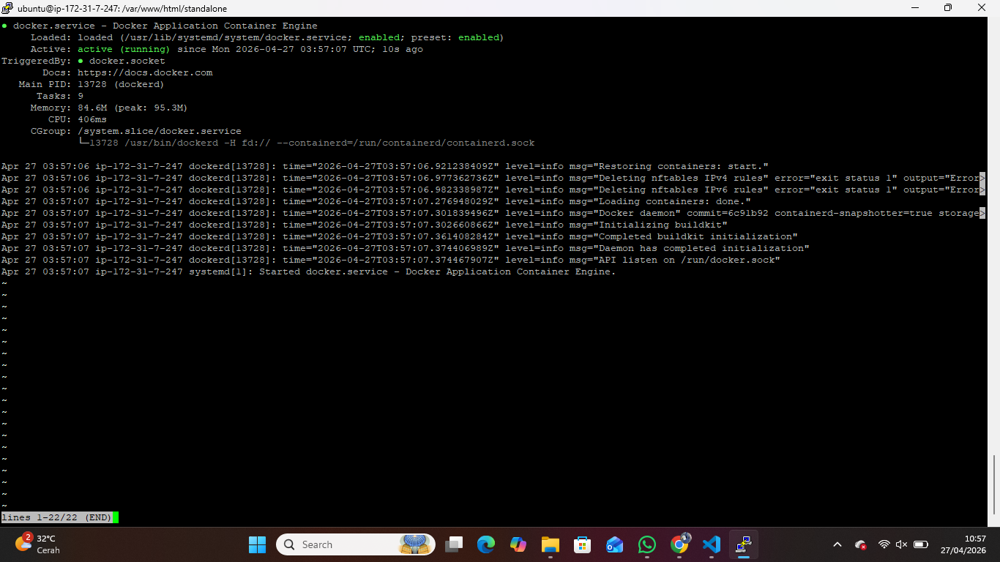
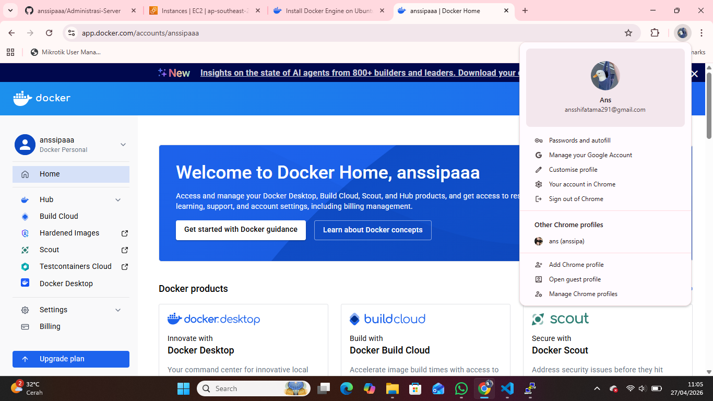
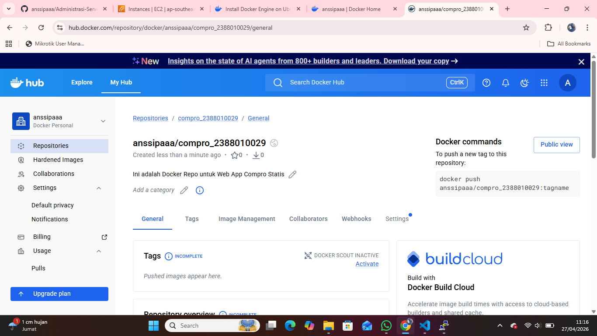
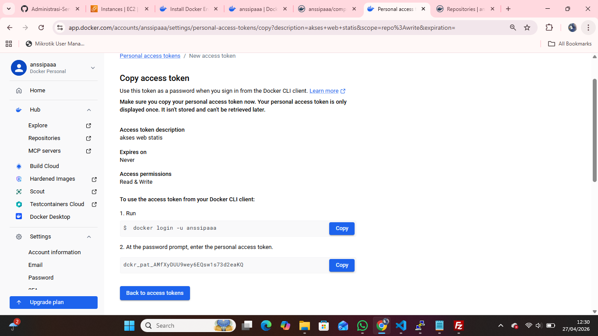
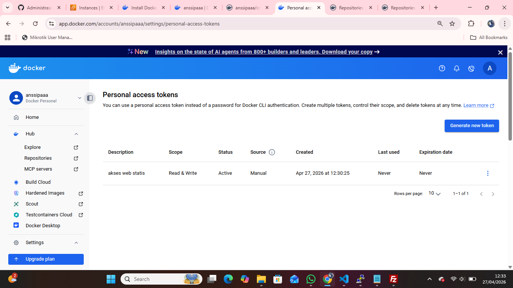
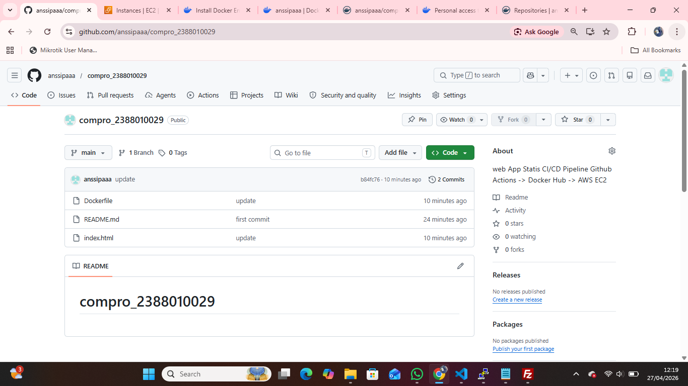

# Intro Docker Engine in Instance EC2 AWS

1. Install based Docker Documentation (https://docs.docker.com/engine/install)
- uninstall old version docker sudo apt remove $(dpkg --get-selections docker.io docker-compose docker-compose-v2 docker-doc podman-docker containerd runc | cut -f1)
- install docker
    1. sudo apt-get update && sudo apt-get upgrade
    2. add sertificate Repo sudo apt install ca-certificates curl sudo install -m 0755 -d /etc/apt/keyrings sudo curl -fsSL https://download.docker.com/linux/ubuntu/gpg -o /etc/apt/keyrings/docker.asc sudo chmod a+r /etc/apt/keyrings/docker.asc
    3. add Docker repository to APT sudo tee /etc/apt/sources.list.d/docker.sources <<EOF Types: deb URIs: $(. /etc/os-release &amp;&amp; echo "$
    {UBUNTU_CODENAME:-$VERSION_CODENAME}") Components: stable Architectures: $(dpkg --print-architecture) Signed-By: /etc/apt/keyrings/docker.asc EOF
    4. Update OS sudo apt update
    5. Install the docker engine sudo apt install docker-ce docker-ce-cli containerd.io docker-buildx-plugin docker-compose-plugin
    6. cek Installation sudo systemctl status docker
    

2. Registrasi Docker Hub
- URL Docker Hub (https://app.docker.com/accounts/1005morinpitalaura)
- Continue with Github

3. Create Repository for Docker
- Klik Menu -> Hub -> Repositories
- Klik Button New Repositories
- isi nama repository dengan compro-2388010040 dan deskripsi Web App Statis Compro
- Visibility Public
- Pilih Create

4. Create token access
- Klik Profile -> Settings -> personal access tokens
- klik generate new token
- isi deskripsi
- expire date

5. Create Projek di local
- buat folder compro_2388010040
- masukkan file index.html
- buat Dockerfile dengan isi sebagai berikut FROM nginx:alpine COPY index.html /usr/share/nginx/html/index.html EXPOSE 80

6. Push projek ke github
