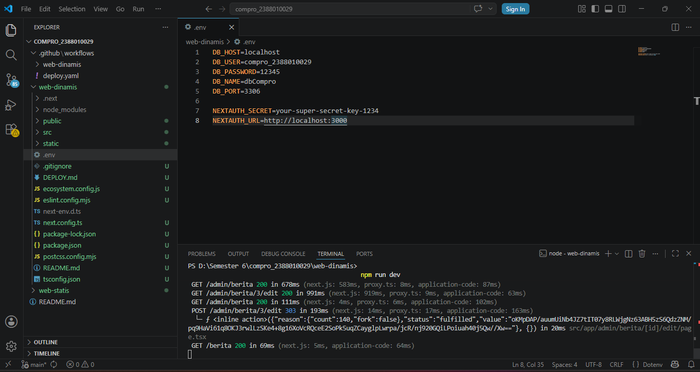
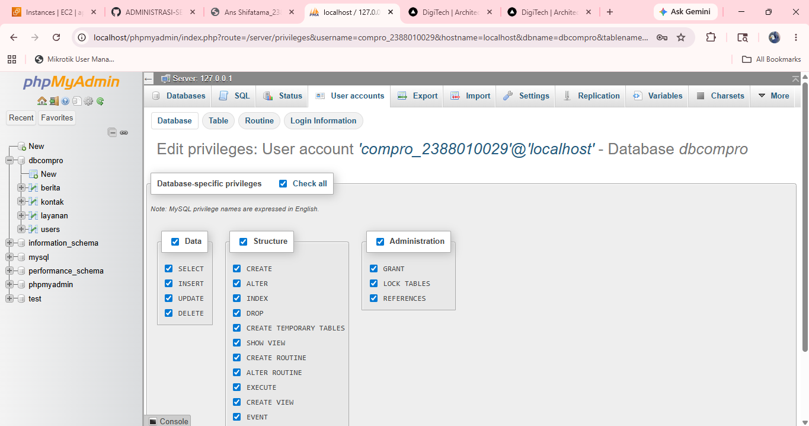
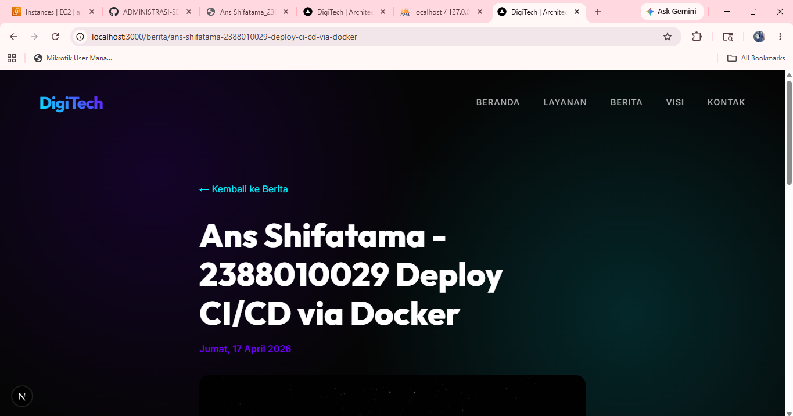
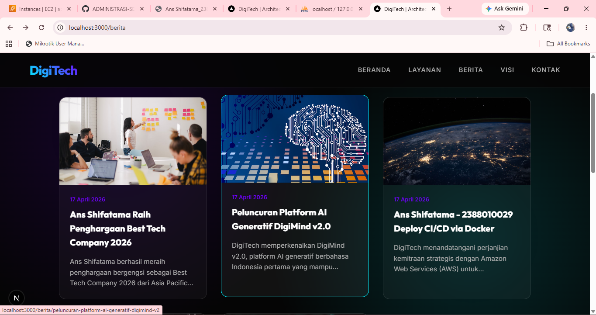

# Deploy Multi Apps CI/CD Docker

1. start instance di AWS EC2
2. patching OS > sudo apt update && sudo apt upgrade
3. hapus layanan nginx dan uninstall > sudo systemctl stop nginx && sudo systemctl disable nginx sudo apt remove nginx-common nginx-core
4. hapus layanan Mariadn dan unisntall > sudo systemctl stop mariadb && sudo systemctl disable mariadb sudo apt remove mariadb-server mariadb-client mariadb-common
5. testing next.js + db menggunakan user bukan root pada local enviroment
- copy project digitech pada ptm6 kecuali folder .next, node_modules, sql, kedalam folder web-dinamis

- create user baru bukan root di DBMS (xampp)

- sesuaikan isi file .env
- open terminal > cd web-dinamis
- npm i
- npm run dev 

