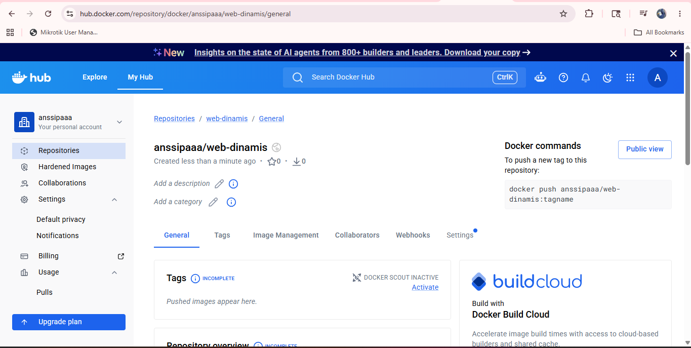
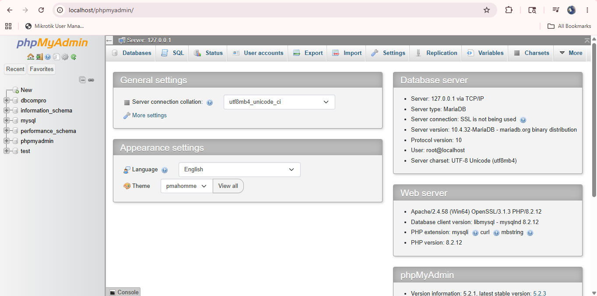
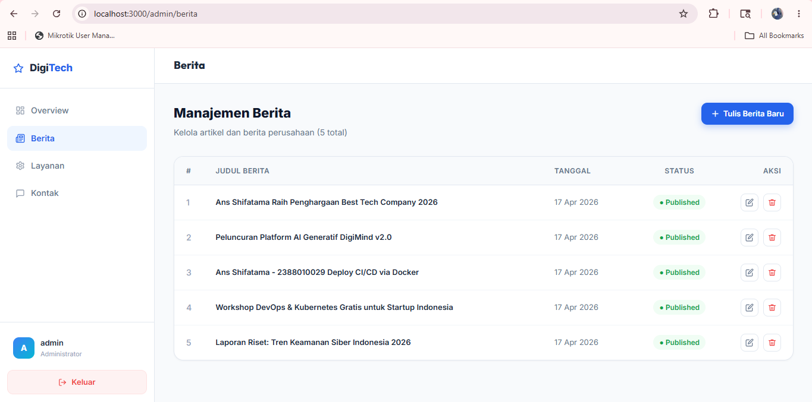
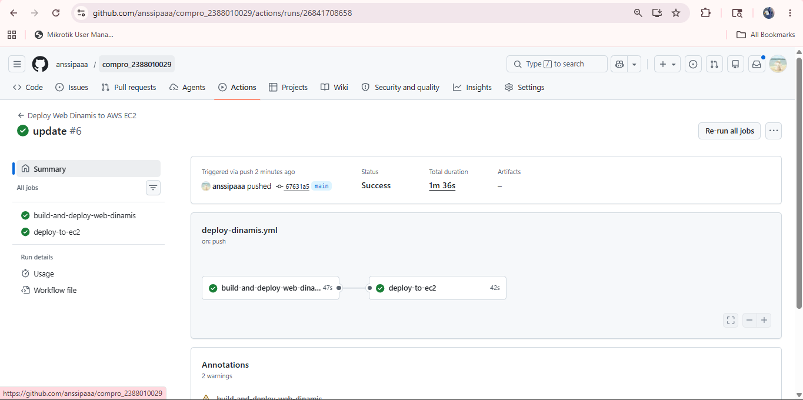
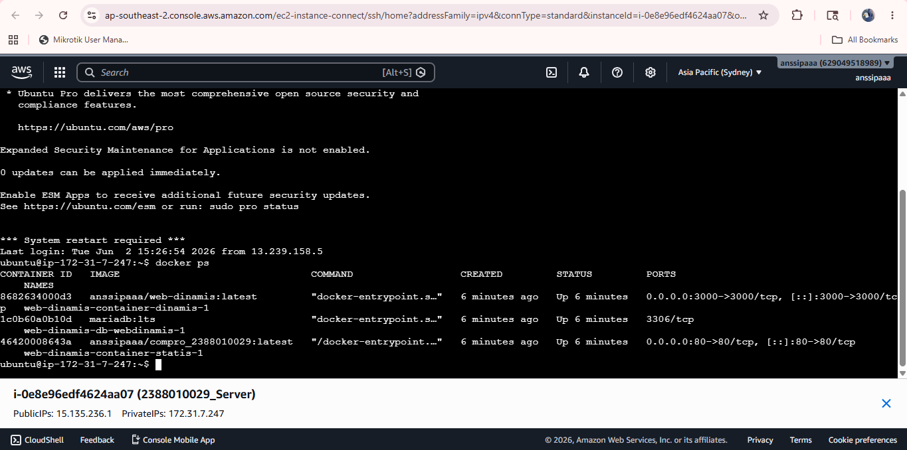
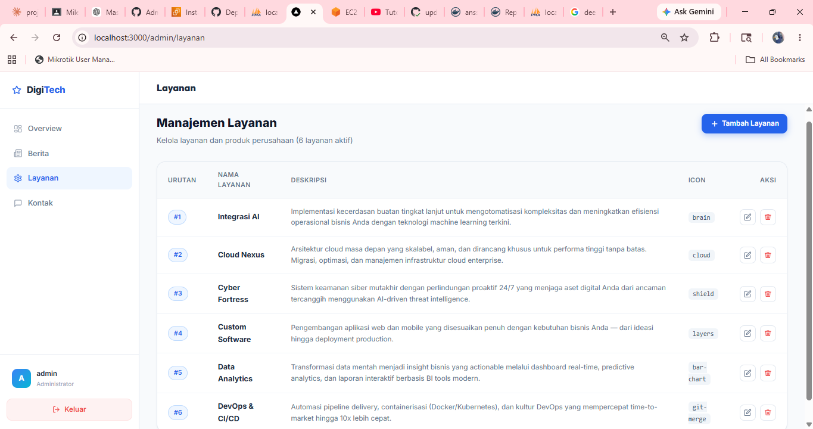

# Deploy Multiple Container menggunakan Docker Compose

1. Start Instance EC2 di AWS
2. Patching OS
3. Uninstall semua Services manual sebelumnya
4. Repositori baru untuk web dinamis di docker hub

5. Buka Projek Company compro_2388010050
6. Bagi 2 Folder untuk projek Web App Statis dan Dinamis
7. Move file index dan Dcoker milik web statis ke Folder web-statis
8. Copy Folder Projek Next.JS (pertemuan9)ke folder web-dinamis
9. Lakukan Testing di Local Project Next.JS
- Install Dependencies: npm install

10. Edit File .env di folder web-dinamis npm run build npm start
11. Pastikan web dapat diakses di http://localhost:3000 admin tanpa error

12. Buat file Dockerfile
13. Buat file docker-compose.yml
14. Buat Workflows File -> deploy-dinamis.yml di folder .github/workflows/ dari Projek web-dinamis
15. Edit File -> deploy.yml di folder .github/workflows/ untuk
16. Update Host AWS di Github
17. Commit Changes ke GitHub dari lokal
18. Push Changes ke GitHub
19. Cek di Github, apakah actions jalan dan berhasil

20. Cek di AWS, apakah container berjalan dengan baik

21. Akses web melalui Browser login admin edit Layanan
