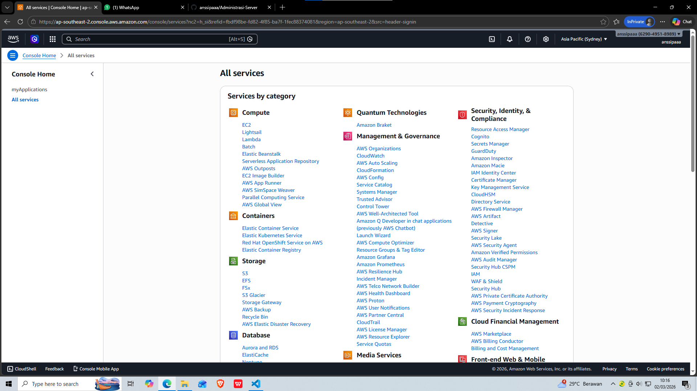
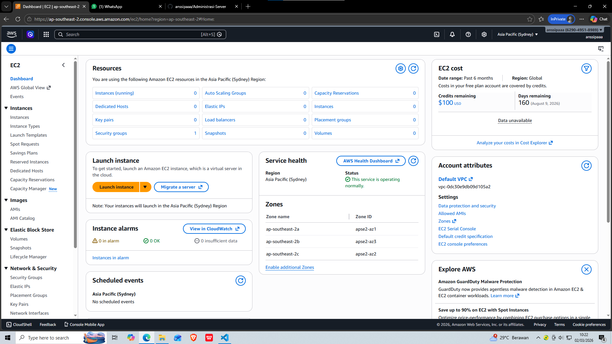
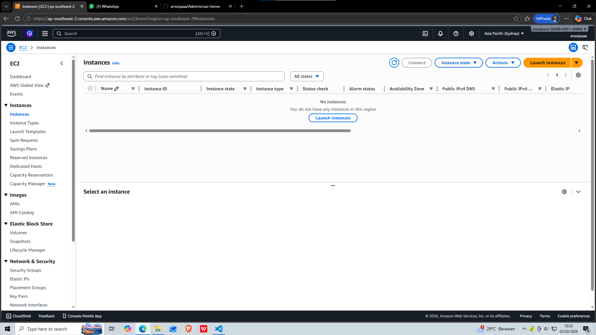
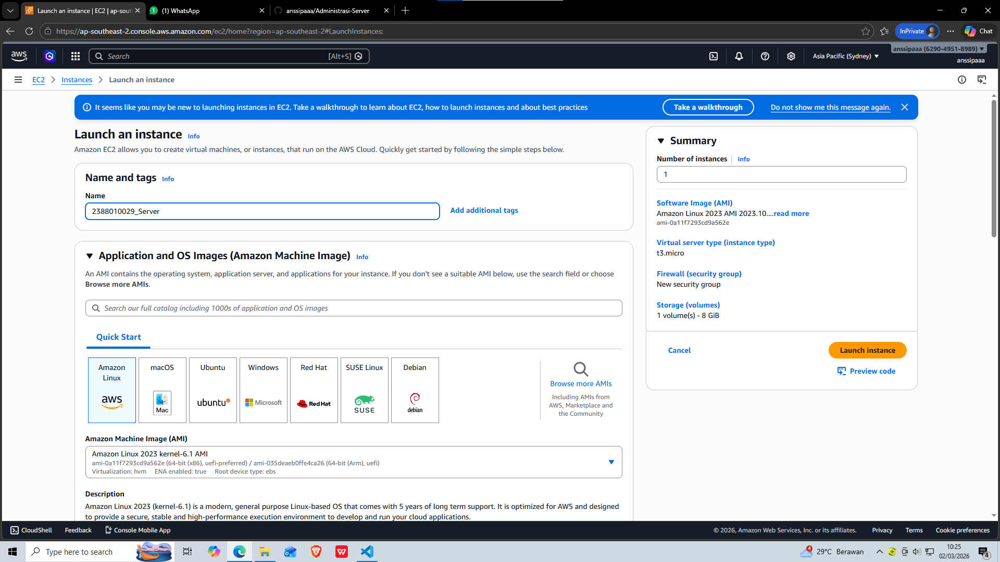
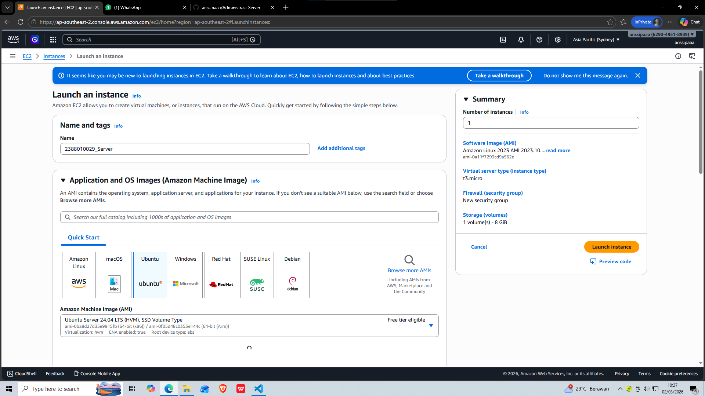
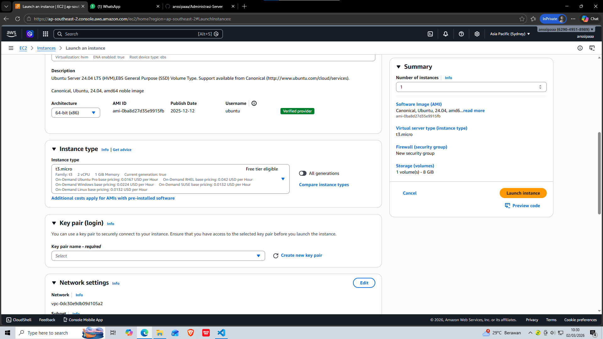
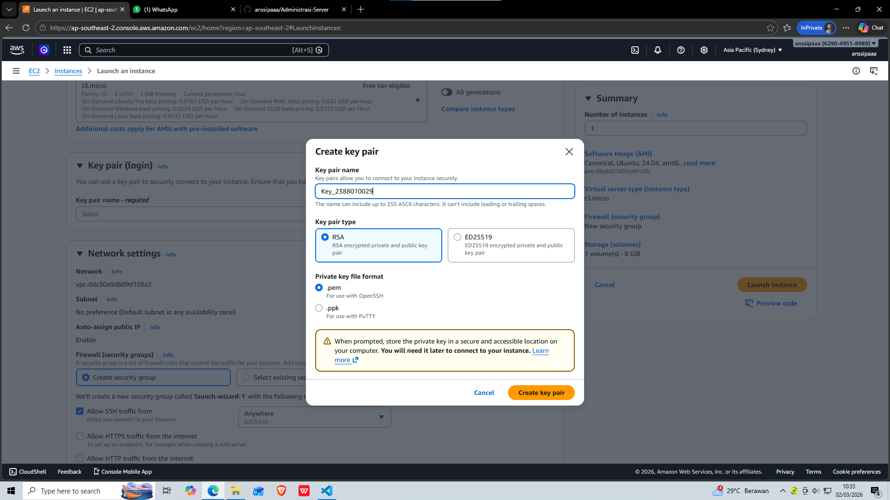
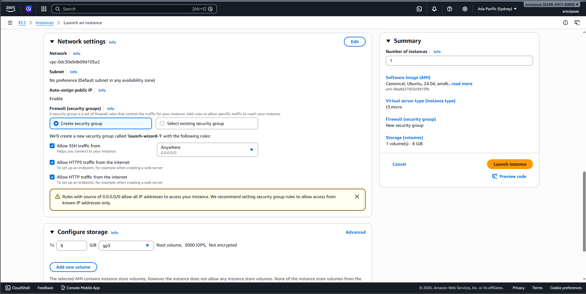
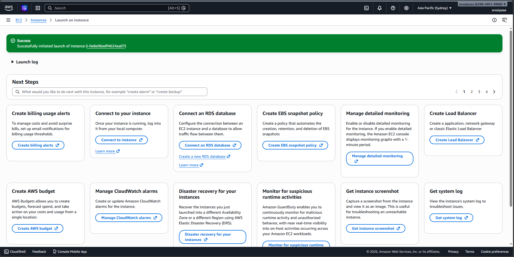

# Membuat EC2/ Instance / VM

1. Pilih menu all services -> Pilih EC@

2. Di dalamn EC2 kita pilih Instance

3. Beri nama Instance kita dengan NIM_Server

4. Kita pilih OS server untuk instance kita

5. Pilih resource instance T3.Micro (2VCPU, 1GB Memory)

6. Membuat Key Pair, pilih new key pair, isi nama key, pilih RSA untuk enkripsi, format file.pem, create key pair

7. setting kebijakan keamanan atau security group
- allow SSH = membolehkan remote SSH dari luar
- allow HTTPS = instance bisa diakses dari protokol HTTPS
- allow HTTP = instance bisa diakses dari protokol HTTP

8. Pastikan launch instance kita sukses
