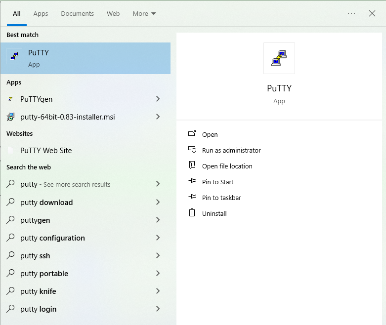
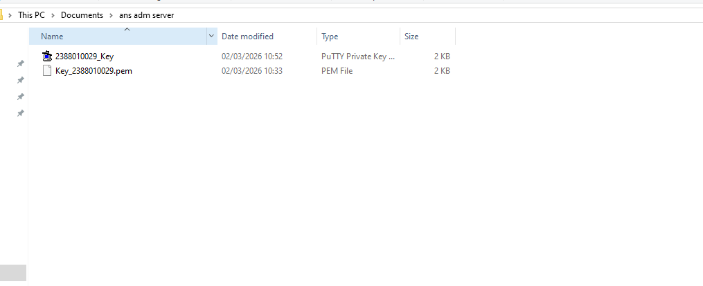
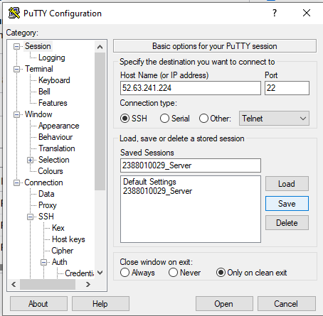
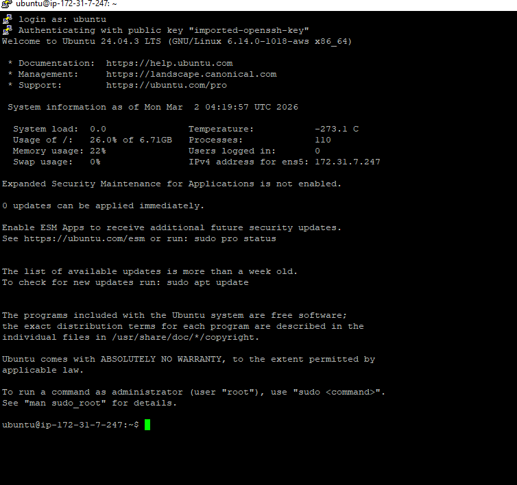
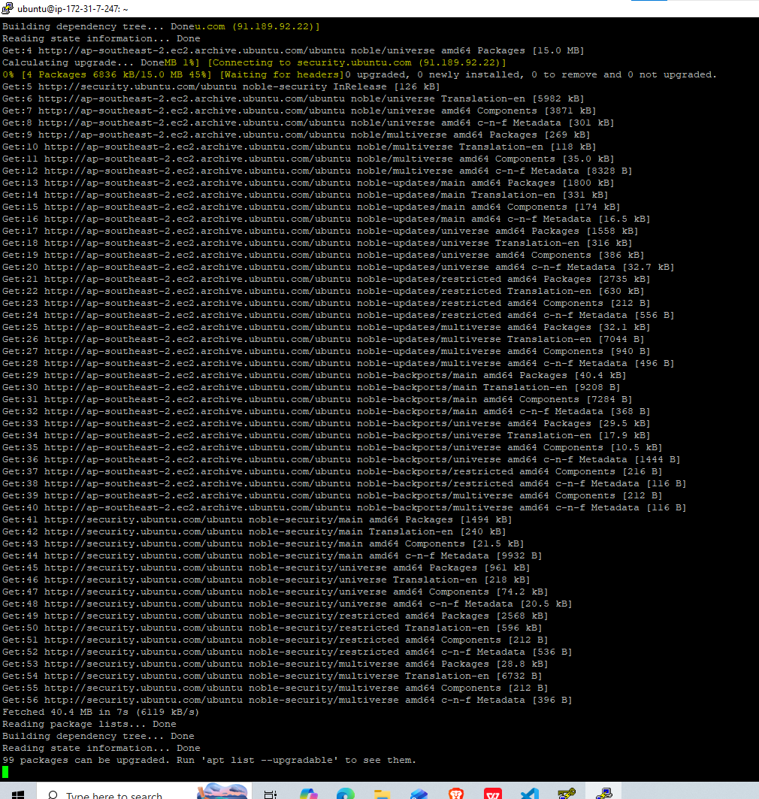
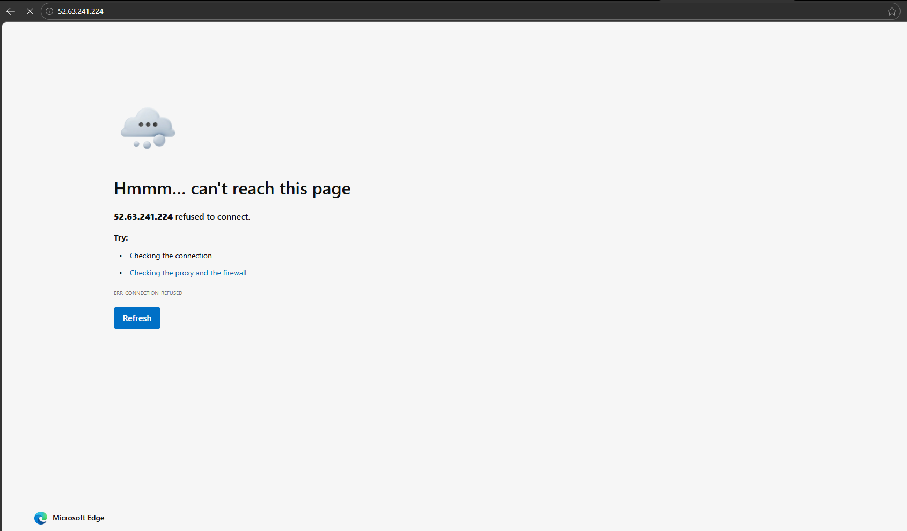
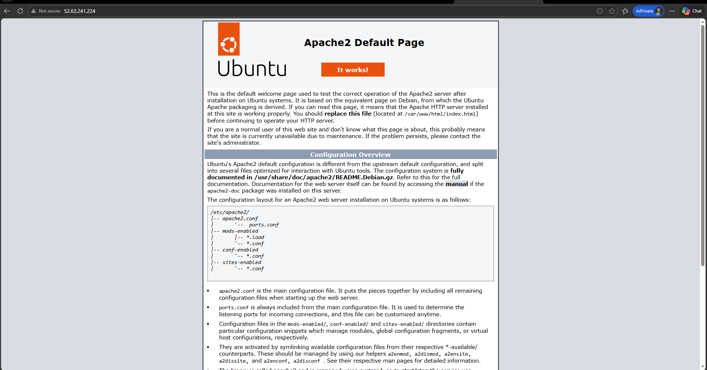
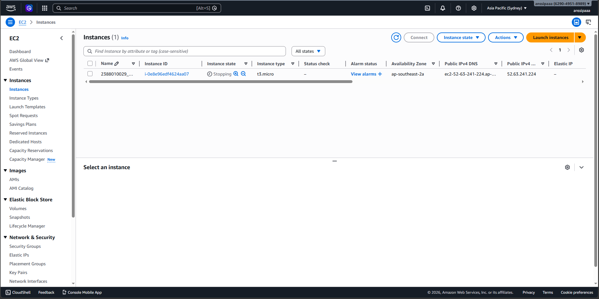

#Remote Instance with SSH putty

1. pastikan sudah install putty (putty.org/index.html) 

2. Konversi file public key dari .pem menjadi .ppk di putty
- buka puttyGen
- load file.pem
- save as .ppk

3. SetUp putty untuk remote SSH
- buka apps putty
- isi IP publik sesuai instance masing-masing
- isi form untuk SSH sesuai Security Group di Instance
- isi nama session agar saat konek lagi tinggal load saja
- load file .ppk (klik SSH -> pilih auth -> credentials -> load file .ppk)
- kembali ke session klik save
- masukkan username ubuntu

4. sudo apt-get Update (Update OS) sudo apt-det upgrade

5. Pembuktian remote SSH secara visual -copy publik IP address instance paste ke browser
- isntall web server apache/nginx
- sudo apt install apache2 -y

6. matikan instance agar tidak kena tagihan
