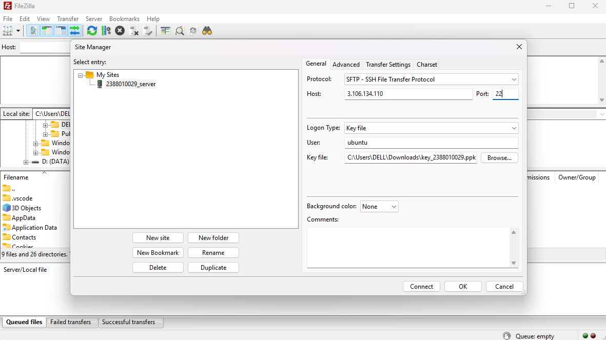
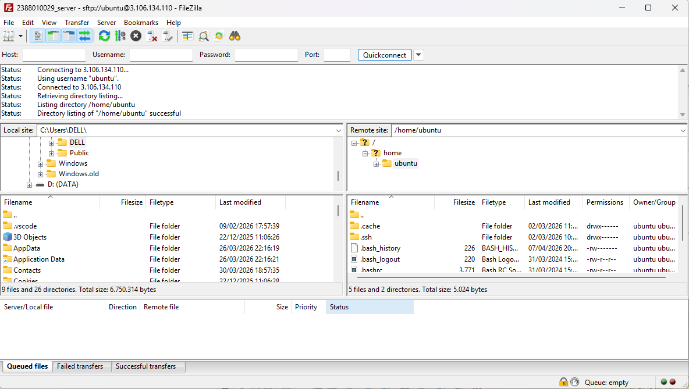
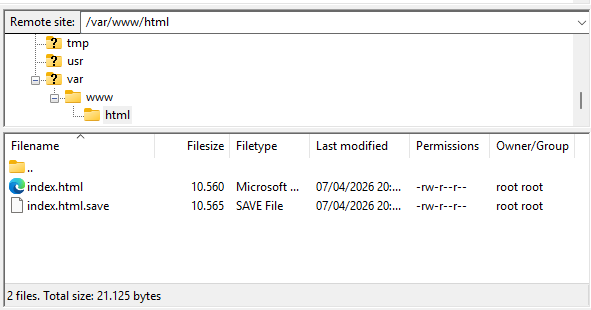
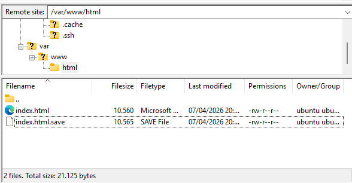
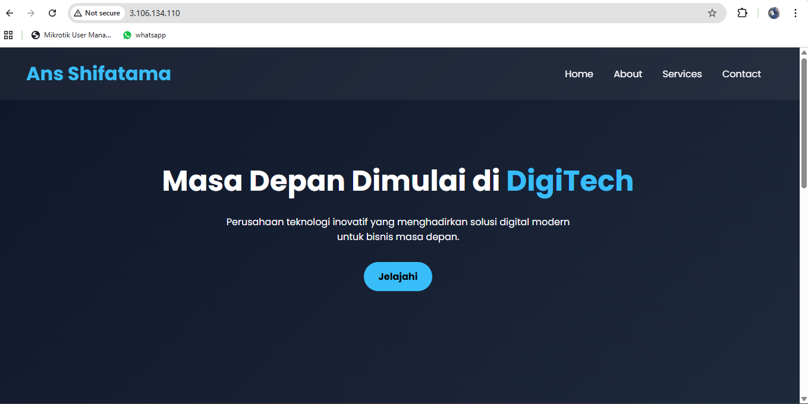

1. Memilih tools migrasi file, misal kita akan gunakan Filezilla
- unduh dan install di https://filezilla-project.org/download.php?type=client
- Buka Filezilla
- Aktifkan INstance di AWS
- Kembali ke FIlezilla Client
- Klik File > Site Manager
- Klik New Site
- Protocol > SFTP
- Host > IP Public EC2
- Port > 22
- Logon Type > Key File
- User > ubuntu
- Key File ? Pilih file .ppk / .pem yang didownload saat membuat instance
- Klik OK
- CTRL S
- Klik Connect

2. Pada dashboard utama filezilla akan terbagi menjadi 2 panel
- Panel Kiri > file local (komputer anda)
- Panel kanan > file server (AWS EC2)

3. Arahkan directory cloud (panel kanan) ke folder web server services area
- /var/www/html

4. Untuk solusi permission denied pada folder /var/www/html
- Ubah kepemilikan folder
- Mengubah folder /var/www/html agar bisa diakses oleh user 'ubuntu'
- Sintaks: sudo chown -R ubuntu:ubuntu /var/www/html

5. Edit File index.html menjadi company Profile
- Klik Kanan pada file index.html
- Klik Edit
- Edit File index.html menjadi company Profile

