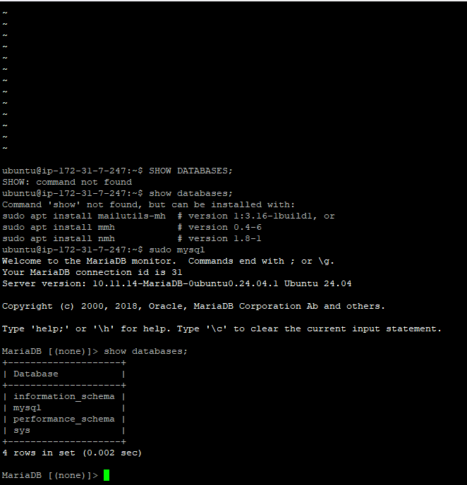
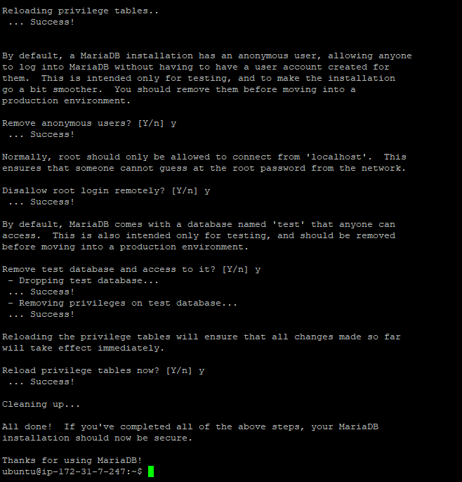
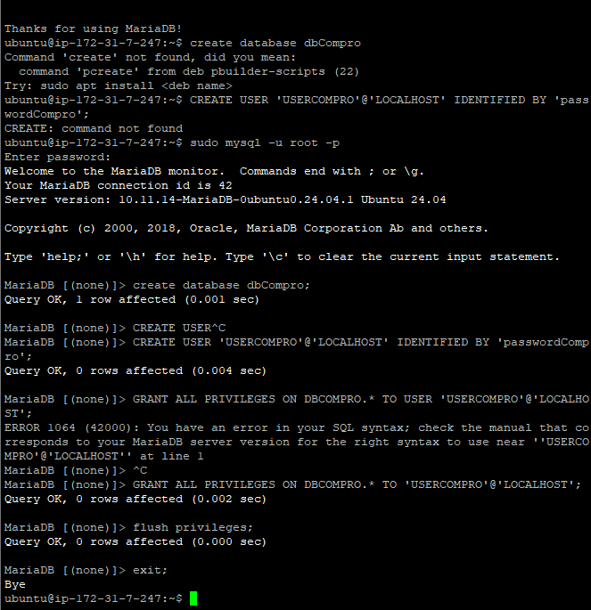
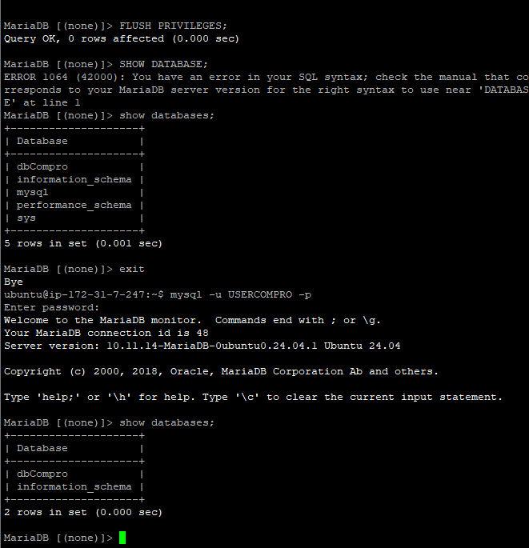

1. Aktifkan Instance/vm di EC2

2. Remote SSH via Terminal
- Masuk ke Folder penyimpanan private key
- masukkan command (ssh -i namafile.pem ubuntu @[IP_ADDRESS])
- enter

3. lakukan patching OS
- sudo apt-get update && sudo apt-get upgrade

4. install MariaDb
- sudo apt-get install mariadb-server
- sudo systemctl status mariadb
- coba apakah default setting yg berlaku (sudo mysql -u root -p)
- cek apakah masih ada database dummy (show database;)

5. kita lakukan hardening security
- masukan command (sudo mysql_secure_installation)
- masukan password db aws server : cipacantik
- remove anonymous users (Y)
- dissallow root login remotely (Y)
- remove test database and access to it (Y)
- reload privilege tables now? (Y)

6. membuat database dan user
- membuat database untuk web company profile (create database dbCompro)
- membuat user untuk web company profile (create user 'userCompro'@'localhost'identified by '***;)
- memberikan hak akses user untuk web company profile (grant all privileges on dbCompro. * to 'userCompro'@'localhost';)
- Flush Privilege (flush privileges;)
- keluar dari MySQL (exit;)

7. login sebagai user baru
- masukkan command (mysql -u userCompro -p)
- masukkan password (***)
- cek apakah password

