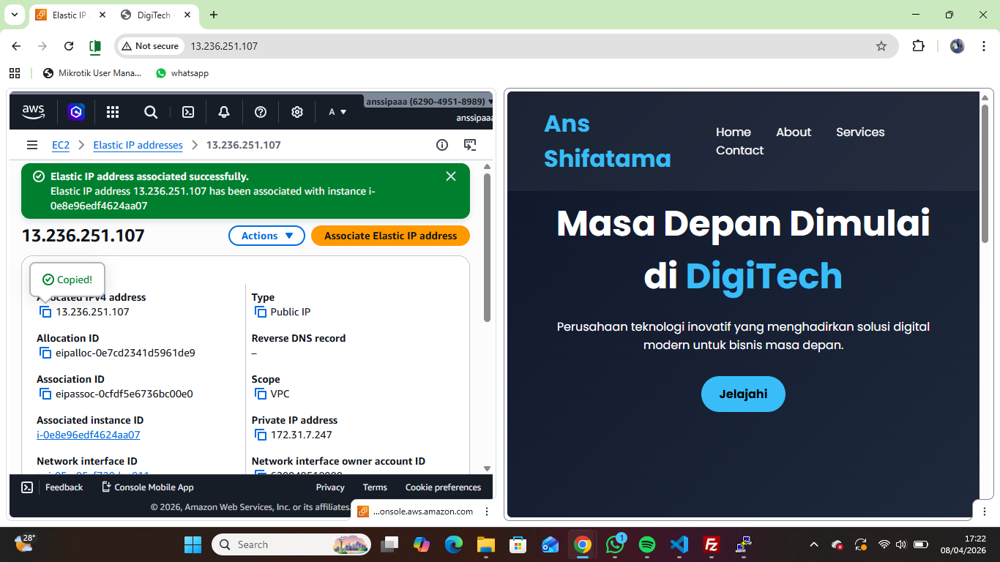

1. Jalankan instance EC2 yang sudah dicraete sebelumnya

2. ke menu network and scurity pilih menu elastic-IP
- craete menu allocate elastic IP address
- Pilih Amazon's pool of IPv4 addresses
- network border group (south east asia)
- isi tags (Key=server-6B value=Praktikum Elastic IP)
- klik Allocate

3. Associate kan elastic IP seger mungkin (>1 jam akan kena cost)
- centang mana EIP yang dipilih
- pilih actions -> associate elastic IP
- resource type yang pilih instance
- klik associate

