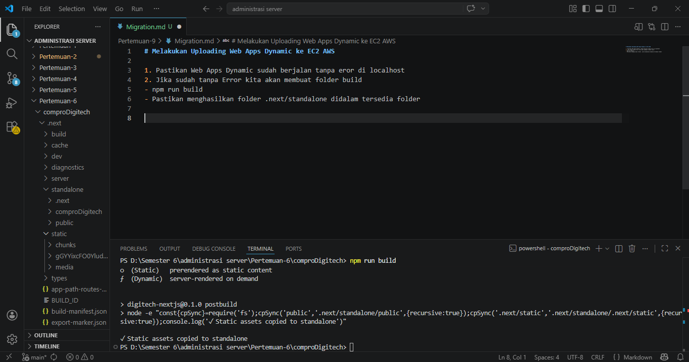
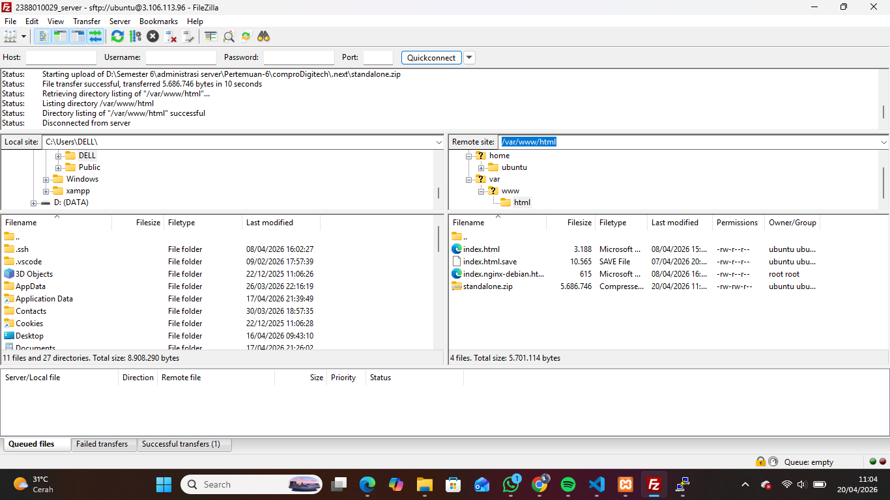
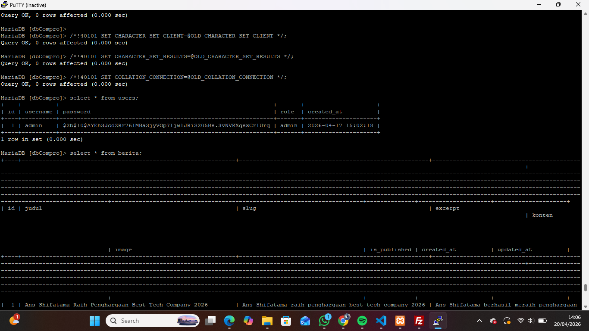
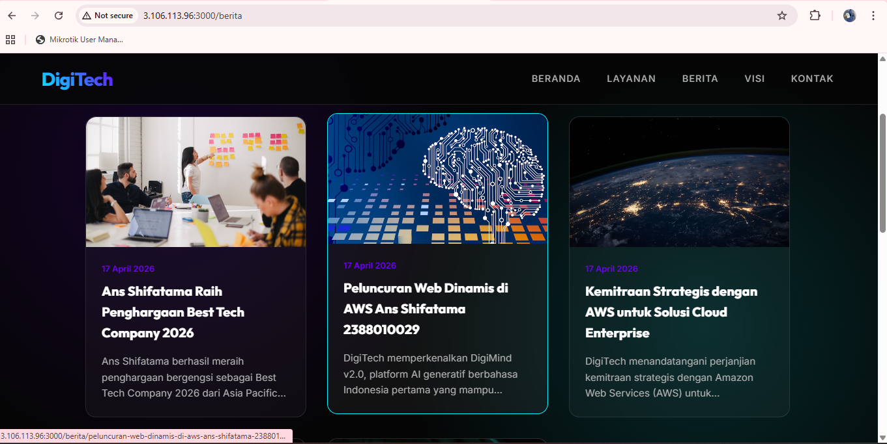

# Melakukan Uploading Web Apps Dynamic ke EC2 AWS

1. Pastikan Web Apps Dynamic sudah berjalan tanpa eror di localhost
2. Jika sudah tanpa Error kita akan membuat folder build
- npm run build
- Pastikan menghasilkan folder .next/standalone didalam tersedia folder Public dan di folder .next ada folder static

3. Proses Upload File Folder Standalone
- Lakukan Proses Archive pada folder .next/standalone dan folder public .zip
- Running Instance -> Connect Open SSH -> Connect Filezilla
- Upload File hasil archive ke EC2 AWS menggunakan Filezilla 

- Extract file hasil archive di EC2 AWS
    1. Install tools Unzip di EC2 AWS
    - sudo apt install unzip -y
    - cd /var/www/html
    - ls
    2. Ekstract file hasil archive
    - unzip nama_file.zip

4. Export dbcompro dari localhost ke sql
- login ke SQL ec2 sudo mysql -u USERCOMPRO -p
- use dbCompro;
- copy paste query SQL dari export dbCompro di Localhost
- cek setiap tabel aoakah sudah terisi
- select * from berita;
- select * from users;

5. Sesuaikan isi file .env
- DB_HOST=localhost
- DB_USER=USERCOMPRO
- DB_PASSWORD=PASSWORD
- DB_NAME=dbCompro
- ctrl s

6. Di termiinal ssh cd ke folderstandalone run apps -pm2 start server.js -pm2 save -pm2 startup

7. Buka port 3000 di securitygroup ec2 aws
- edit inbound ruls -add rule
    1. save
    2. check perubahan -
    