# UAS Administrasi Server 6B Ans Shifatama 2388010029

# WEB STATIS

1. Buat Instance EC2 Baru dan Runing
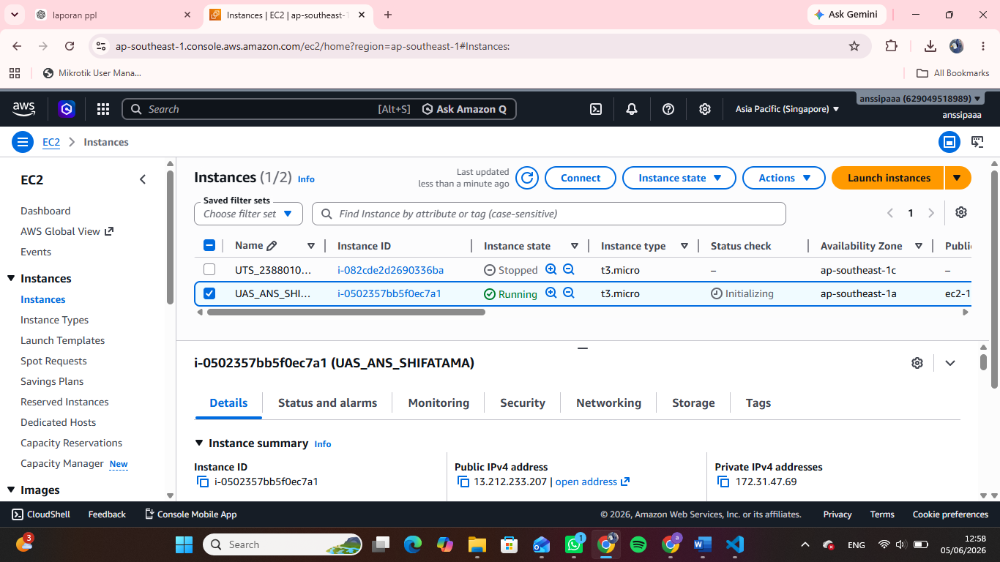

2. Patching OS Ubuntu
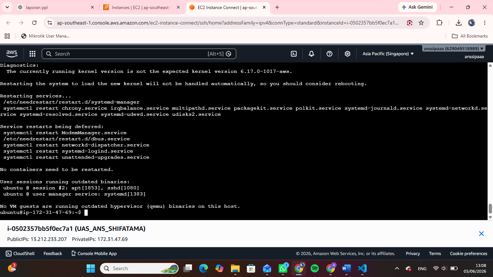

3. Buat Repositori Github Baru
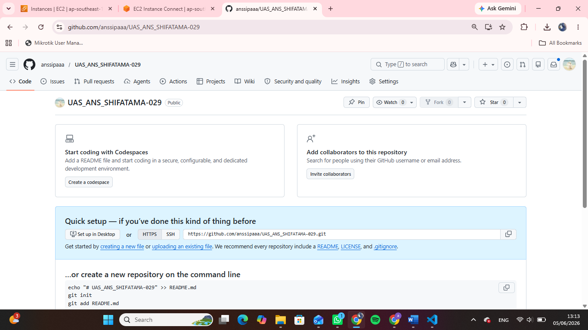

4. Intall docker di terminal ubuntu dan cek systemctl runing
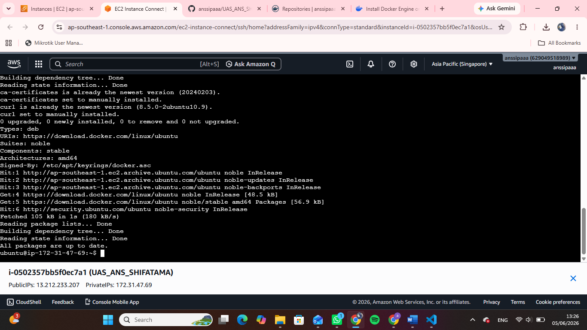

5. Buat Repo di docker
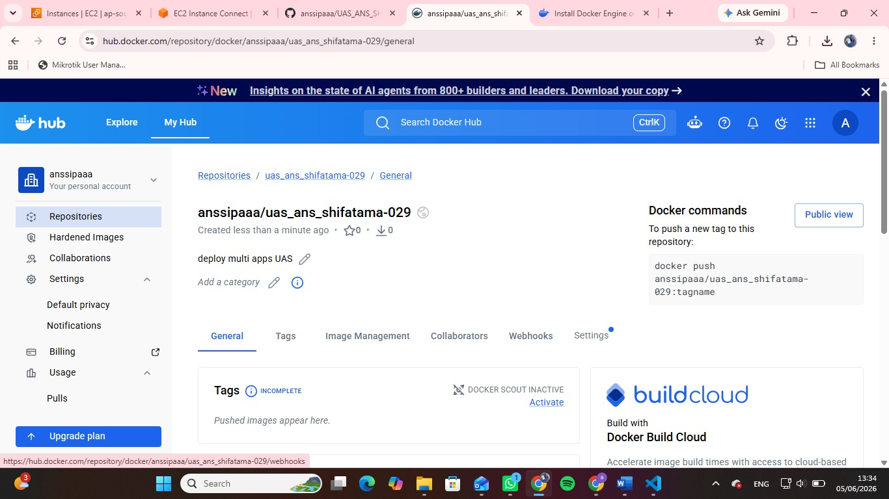

6. Buat token di docker
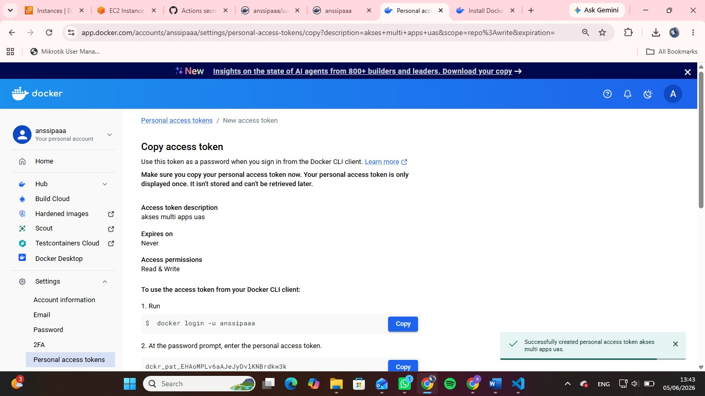
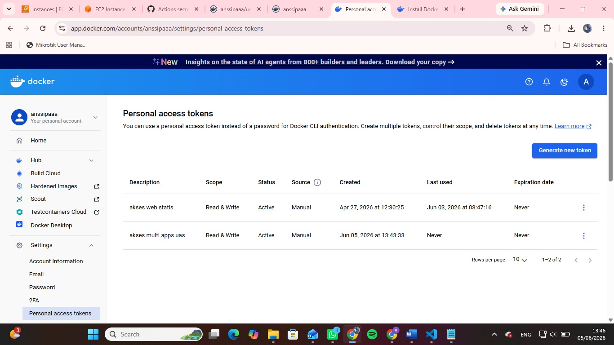

7. Buat secret_key di github
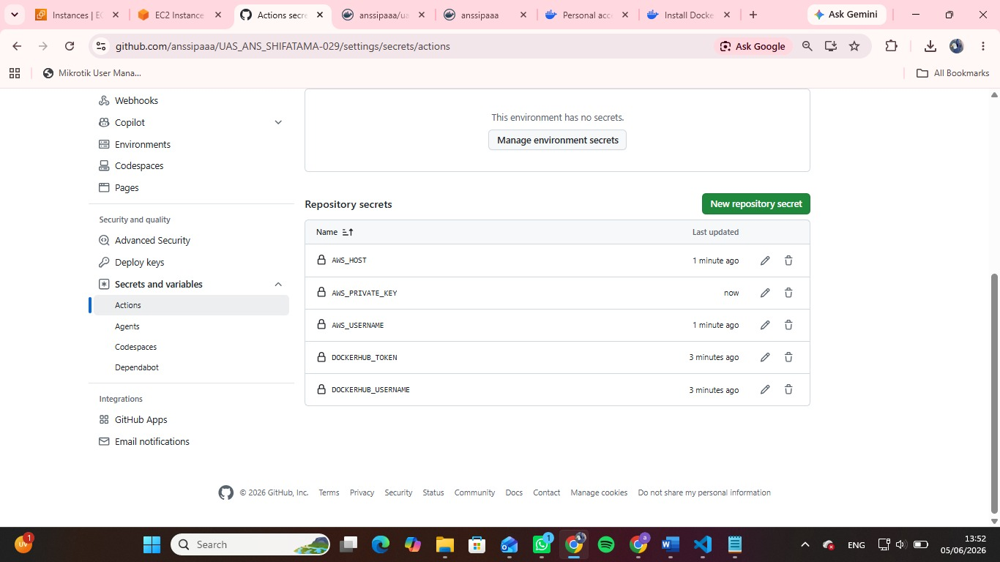

8. Deploy web statis
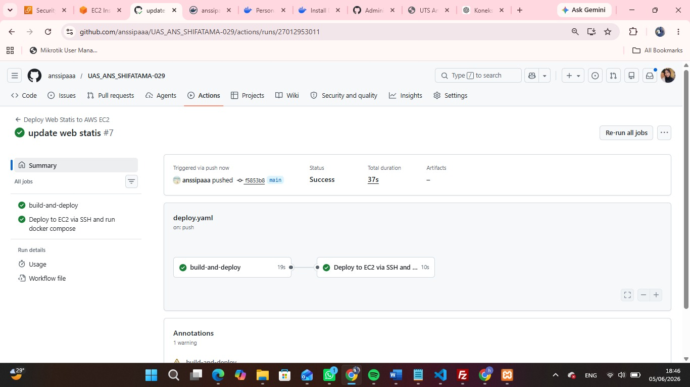

9. Tampil Web CV Statis
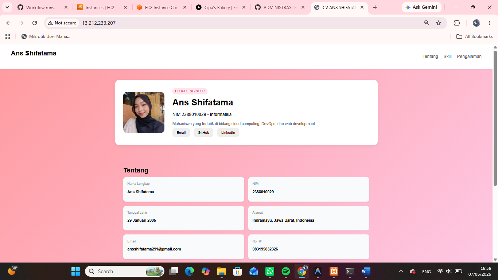

# WEB DINAMIS

1. Buat db baru 'dbuas' dan buat user account baru 'db_uas' beri privelleage untuk db 'dbuas029'
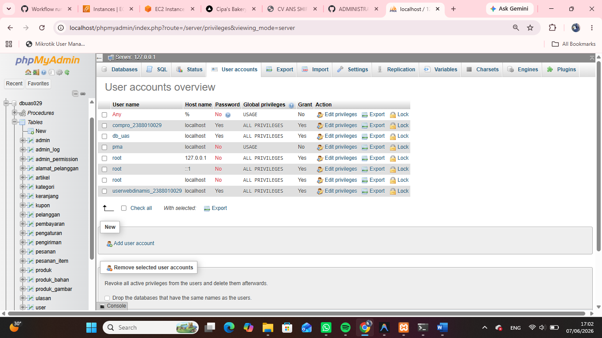

2. Buat repo docker untuk web dinamis
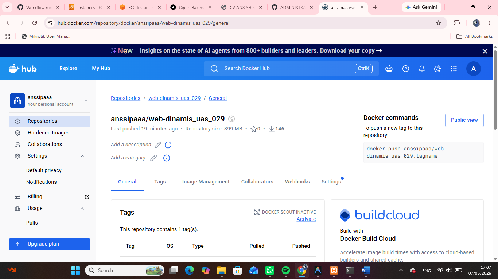

3. buat Website dinamis (Bakery)
- Buat Dockerfile yg menyesuaikan dengan bahasa dipakai
- Buat juga file docker-compose.yml di dalam folder web-dinamis
- Buat deploy-web-dinamis.yml

4. Deploy Web-Dinamis
- Git action Hijau
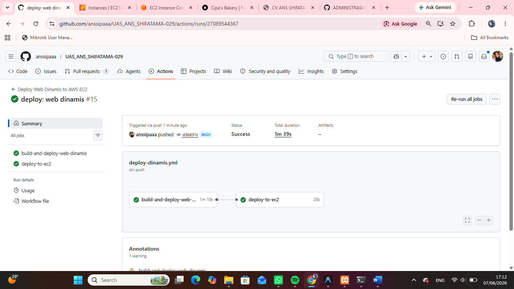

- Dashboard
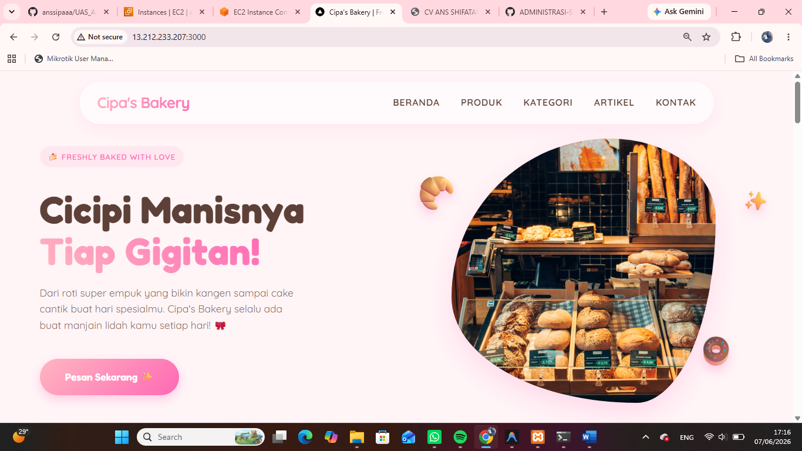

- Login Admin
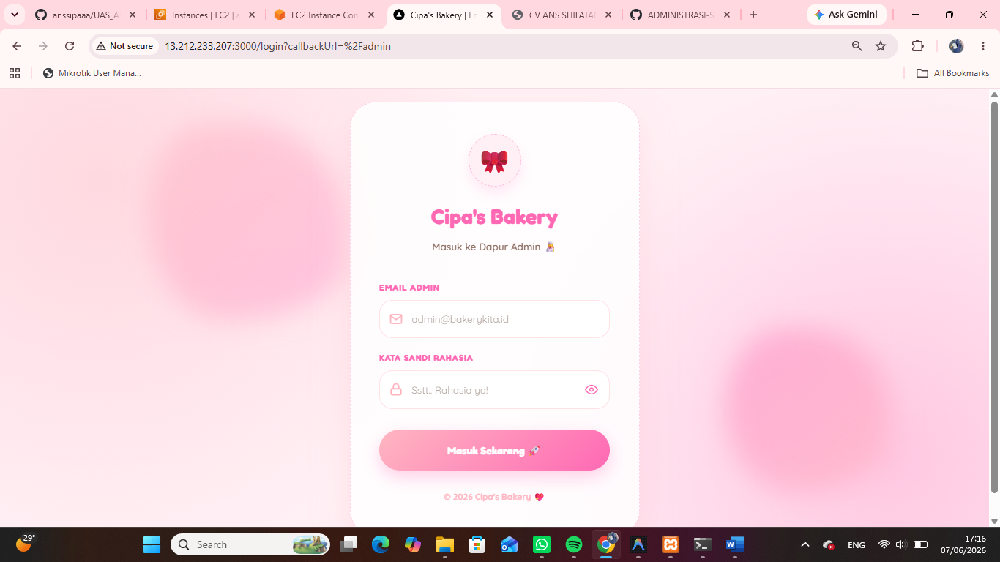
username : admin@bakerykita.id, password : admin123

- Admin
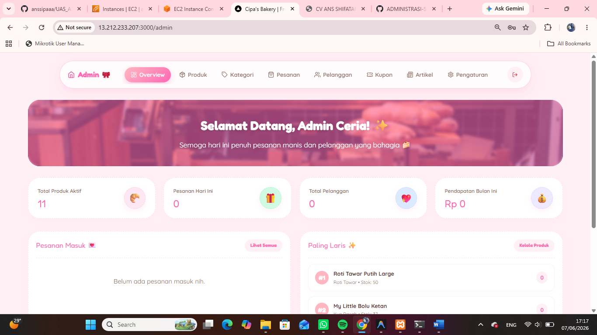